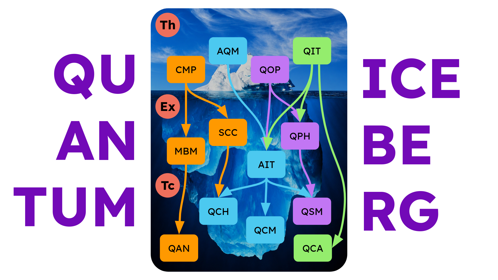

# Charla sobre Tecnologías Cuánticas

by Jose Javier Fernández [ jjavierf@proton.me ]

## Objetivo

Introducir a los estudiantes a las tecnologías cuánticas existentes y en desarrollo, centros de investigación, oportunidades, etc.

## Quantum Iceberg

Nomenclatura:

- **Th** Teoría

	- **CMP** Condensed Matter Physics

	- **AQM** Advanced Quantum Mechanics

	- **QOP** Quantum Optics

	- **QIT** Quantum Information Theory

- **Ex** Experimental

	- **MBM** Many-Body & Materials

	- **SCC** Superconducting Circuits

	- **AIT** Atom and Ion Trapping

	- **QPH** Quantum Photonics

- **Tc** Tecnología

	- **QCH** Quantum Computing Hardware

	- **QCM** Quantum Communications

	- **QSM** Quantum Sensing and Metrology

	- **QAN** Quantum Annealing

	- **QCA** Quantum Computing Algorithms

## Directorio

### Universidades y Programas

 - Universidad de Barcelona + Universidad Politécnica de Cataluña + Universidad Autónoma de Barcelona
   - [Master in Quantum Science and Technology](https://quantummasterbarcelona.eu/)
   - [Master in Photonics](https://photonics.masters.upc.edu/en)
   - [Catalonia Quantum Academy](https://cataloniaquantum.eu/)

 - Erasmus (varias universidades)
   - [Master in Quantum Technologies and Engineering](https://www.quanteem.eu/)

 - Technische Universität Munchen
   - [Master in Quantum Science and Technology](https://academics.nat.tum.de/en/msc/qst)
 
 - Jena
   - [Master in Quantum Science and Technology](https://www.asp.uni-jena.de/9229/m-sc-quantum-science-technology)

 - Copenhague
   - [Master in Quantum Information Science](https://www.ku.dk/studies/masters/quantum-information-science)

 - Technische Universität Delft
   - [Master in Quantum Information Science and Technology](https://www.tudelft.nl/onderwijs/opleidingen/masters/qist/msc-quantum-information-science-technology)

 - Sorbonne

### Centros de Investigación

 - Universidad de Barcelona
 - Universidad Autónoma de Barcelona
 - Universidad Politécnica de Catalunya
 - [Instituto de Ciencias Fotónicas (ICFO)](https://www.icfo.eu/es/)
 - [Instituto Catalán de Nanociencia y Nanotecnología](https://www.icn2.cat/en/)
 - [i2cat](https://i2cat.net/)
 - [Barcelona Supercomputing Center](https://www.bsc.es/)

### Empresas y Startups

 - [Qilimanjaro](https://qilimanjaro.tech/) (Full-stack Quantum Computing Startup)
 - [LuxQuanta](https://luxquanta.com/) (Quantum Communications Startup)
 - [Quside](https://quside.com/) (Quantum Random Number Generation)
 - [Atom Computing](https://atom-computing.com/) (Neutral Atoms Computing)
 - [Quantinuum](https://www.quantinuum.com/) (Quantum Computing)

### Otros Proyectos

Importantes para mapear y descubrir oportunidades

 - [Quantum Flagship](https://qt.eu/)
 - [Quantum Jobs List](https://www.quantumjobslist.com/)

